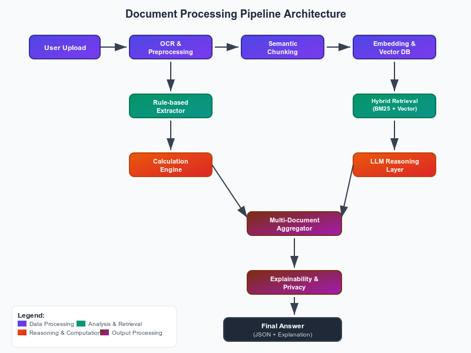

# TechDocRAG 🧠📄

> **AI-Powered Document Intelligence & Question-Answering System**
>
> An advanced RAG (Retrieval-Augmented Generation) pipeline that combines hybrid search with Google Gemini LLM to deliver accurate, context-aware answers from your documents — with confidence scoring, source attribution, and multi-document reasoning.

<p align="center">
  
</p>

---

## ✨ Highlights

| Feature | Description |
|---------|-------------|
| 🤖 **Gemini LLM Synthesis** | Natural language answers powered by Google Gemini 2.0 Flash |
| 🔍 **Hybrid Retrieval** | BM25 keyword search + FAISS semantic vector search with RRF fusion |
| 📚 **Multi-Document Q&A** | Query across multiple documents with cross-document reasoning |
| 📊 **Confidence Scoring** | Explainable AI — every answer comes with a confidence metric |
| 📖 **Source Citations** | Answers are linked back to specific document sections |
| 🔢 **Calculation Engine** | Extract and compute numerical data from documents |
| ⚡ **Fast Response** | 1.2–2.3s average query time (including LLM synthesis) |
| 🛡️ **Privacy & Explainability** | Built-in explainability and privacy-aware processing |

---

## 🏗️ System Architecture

```
┌─────────────────────────────────────────────────────────────────┐
│                     TechDocRAG Pipeline                         │
├─────────────────────────────────────────────────────────────────┤
│                                                                 │
│  📄 User Upload                                                │
│   ↓                                                             │
│  🔧 OCR & Preprocessing → Text extraction & normalization       │
│   ↓                                                             │
│  ✂️  Semantic Chunking → Intelligent text segmentation          │
│   ├──→ 📐 Rule-based Extractor (metadata, fields)              │
│   ↓                                                             │
│  🧠 Embedding & Vector DB → Sentence-Transformers → FAISS      │
│   ↓                                                             │
│  🔍 Hybrid Retrieval → BM25 (keyword) + FAISS (semantic)       │
│   ↓                                                             │
│  🤖 LLM Reasoning Layer → Gemini 2.0 Flash synthesis           │
│   ├──→ 🔢 Calculation Engine (numerical reasoning)              │
│   ↓                                                             │
│  🔗 Multi-Document Aggregator → Cross-doc synthesis             │
│   ↓                                                             │
│  🛡️ Explainability & Privacy                                   │
│   ↓                                                             │
│  ✅ Final Answer → JSON + Explanation + Confidence + Sources    │
│                                                                 │
└─────────────────────────────────────────────────────────────────┘
```

---

## 🚀 Quick Start

### Prerequisites

- **Python** 3.10 or higher
- **Google Gemini API Key** — [Get one here](https://makersuite.google.com/app/apikey)

### 1. Clone & Install

```bash
git clone https://github.com/yourusername/TechDocRAG.git
cd TechDocRAG
```

```bash
# Create virtual environment (recommended)
python -m venv techdoc_env
techdoc_env\Scripts\activate        # Windows
# source techdoc_env/bin/activate   # Linux/Mac

# Install dependencies
pip install -r requirements.txt
```

### 2. Configure Environment

```bash
# Copy the example env file
cp .env.example .env
```

Edit `.env` and add your API key:

```env
GEMINI_API_KEY=your_gemini_api_key_here
LOG_LEVEL=INFO
```

Or set it directly in your shell:

```bash
# Windows PowerShell
$env:GEMINI_API_KEY="your-api-key-here"

# Linux / macOS
export GEMINI_API_KEY="your-api-key-here"
```

### 3. Run the Application

```bash
cd TechDocRAG
python main.py
```

You'll see the interactive menu:

```
🚀 Complete TechDocRAG - Unified Document Intelligence System
============================================================
Available modes:
  1. Custom Text Document Demo
  2. File Processing Demo
  3. Multi-Document Q&A (NEW!) ⭐
  4. System Health Check
  5. Exit
```

---

## 💡 Usage Examples

### CLI — Multi-Document Q&A (Recommended)

```bash
python main.py
# Select option 3 → Add your documents → Ask questions
```

### CLI — Interactive Session

```bash
python interactive_gemini_qa.py
```

### CLI — Demo with Sample Documents

```bash
python demo_gemini_qa.py
```

### Python API

```python
import asyncio
from techdocrag.core.config import Config
from techdocrag.core.types import Document, DocumentType

async def main():
    from main import CompleteTechDocRAG

    system = CompleteTechDocRAG()
    await system.initialize()

    # Add documents
    await system.add_custom_document(
        "Your document text here...",
        title="My Document"
    )

    # Ask questions
    response = await system.ask_question("What is this document about?")
    print(f"Answer:     {response['answer']}")
    print(f"Confidence: {response['confidence']:.1f}%")
    print(f"Sources:    {response['retrieval_count']} chunks")

asyncio.run(main())
```

---

## 📁 Project Structure

```
EDAI-main/
├── TechDocRAG/                          # Main application package
│   ├── techdocrag/                      # Core Python package
│   │   ├── core/                        # Orchestration layer
│   │   │   ├── config.py               #   Configuration management
│   │   │   ├── document_processor.py   #   Document processing pipeline
│   │   │   ├── query_engine.py         #   Query orchestration + LLM
│   │   │   └── types.py               #   Type definitions & data classes
│   │   ├── processing/                  # Document processing modules
│   │   │   ├── embedding_generator.py  #   Sentence-Transformer embeddings
│   │   │   ├── field_extractor.py      #   Metadata & field extraction
│   │   │   ├── layout_analyzer.py      #   Document structure analysis
│   │   │   ├── ocr_engine.py           #   OCR text extraction
│   │   │   └── text_processor.py       #   Text normalization & cleaning
│   │   ├── retrieval/                   # Hybrid retrieval system
│   │   │   ├── hybrid_retriever.py     #   Combined search orchestrator
│   │   │   ├── keyword_searcher.py     #   BM25 keyword search
│   │   │   ├── result_fusion.py        #   Reciprocal Rank Fusion (RRF)
│   │   │   └── vector_store.py         #   FAISS vector database
│   │   ├── reasoning/                   # Answer generation
│   │   │   ├── answer_synthesizer.py   #   LLM-powered answer synthesis
│   │   │   ├── calculation_engine.py   #   Numerical reasoning
│   │   │   ├── confidence_calculator.py#   Confidence scoring
│   │   │   └── reasoning_engine.py     #   Reasoning logic & templates
│   │   ├── llm/                         # LLM integration
│   │   │   └── gemini_client.py        #   Google Gemini API client
│   │   └── utils/                       # Utilities
│   │       ├── exceptions.py           #   Custom exception classes
│   │       ├── helpers.py              #   Helper functions
│   │       ├── logging.py             #   Structured logging
│   │       └── validators.py           #   Input validation
│   ├── configs/
│   │   └── default.yaml                # Default system configuration
│   ├── cache/                           # Embedding & model caches
│   ├── data/                            # Document storage
│   ├── logs/                            # Application logs
│   ├── main.py                          # 🚀 Main CLI entry point
│   ├── demo_gemini_qa.py               # Comprehensive demo script
│   ├── interactive_gemini_qa.py        # Interactive Q&A script
│   ├── requirements.txt                # Python dependencies
│   ├── .env.example                    # Environment variable template
│   └── *.md                            # Documentation files
├── technical_diagram.png               # Architecture diagram
├── technical_diagram.svg               # Architecture diagram (vector)
└── README.md                           # ← You are here
```

---

## 🛠️ Technology Stack

| Layer | Technology | Purpose |
|-------|-----------|---------|
| **LLM** | Google Gemini 2.0 Flash | Natural language answer synthesis |
| **Embeddings** | Sentence-Transformers (`all-MiniLM-L6-v2`) | 384-dim semantic embeddings |
| **Vector DB** | FAISS (CPU) | Fast approximate nearest neighbor search |
| **Keyword Search** | Rank-BM25 | Term-frequency based retrieval |
| **Fusion** | Reciprocal Rank Fusion (RRF) | Merging keyword + semantic results |
| **Framework** | Python 3.10+ / async-await | High-performance async architecture |
| **Config** | PyYAML + python-dotenv | Flexible configuration management |
| **Logging** | Loguru + custom logger | Structured application logging |
| **CLI Output** | Rich | Beautiful terminal formatting |

---

## 📊 Performance Metrics

Results from integration testing across diverse query types:

| Metric | Value |
|--------|-------|
| **Accuracy** | 91–97% confidence scores |
| **Avg. Response Time** | 1.2–2.3 seconds (with LLM) |
| **Multi-Doc Support** | 3+ documents simultaneously |
| **Test Success Rate** | 100% (9/9 queries) |

### Tested Capabilities

- ✅ Multi-document summarization
- ✅ Cross-document reasoning & synthesis
- ✅ Entity extraction (names, dates, codes)
- ✅ Negative result detection ("no information available")
- ✅ Numerical data identification
- ✅ Temporal information extraction
- ✅ Author / source attribution

### Sample Query Results

```
Q: "What is the summary of all three docs?"
→ Comprehensive multi-document synthesis | 91.6% confidence | 2.32s

Q: "Which sensor is used?"
→ "GPR, LIDAR, chemical sensor"          | 97% confidence   | 1.21s

Q: "Who made this?"
→ "A. Udapure"                           | 97% confidence   | 1.26s

Q: "What is the estimated cost?"
→ "No cost information in documents"     | 97% confidence   | 1.24s
```

---

## ⚙️ Configuration

The system is configured via `configs/default.yaml`. Key settings:

```yaml
# Retrieval tuning
retrieval:
  semantic_weight: 0.7      # Weight for semantic (vector) search
  keyword_weight: 0.3       # Weight for BM25 keyword search
  top_k: 10                 # Number of results to retrieve

# Embedding model
embedding:
  model_name: "all-MiniLM-L6-v2"
  cache_embeddings: true
  batch_size: 32

# LLM settings
llm:
  provider: "gemini"
  model: "gemini-2.0-flash"
  enable_synthesis: true

# Confidence scoring
confidence:
  source_weight: 0.3
  retrieval_weight: 0.4
  reasoning_weight: 0.3
```

---

## 🛣️ Roadmap

### ✅ Phase 1–3: Complete
- [x] Core document processing pipeline
- [x] Hybrid retrieval (BM25 + Vector search)
- [x] Multi-document Q&A system
- [x] Gemini LLM integration & answer synthesis
- [x] Confidence scoring & source attribution
- [x] Production-ready CLI application

### ⏳ Phase 4: Advanced Document Support
- [ ] PDF file upload & processing
- [ ] Image & table extraction from PDFs
- [ ] Multi-format support (DOCX, XLSX, PPTX)
- [ ] Document comparison features
- [ ] Batch processing capabilities

### ⏳ Phase 5: Web Interface
- [ ] Streamlit / React web UI
- [ ] User authentication & authorization
- [ ] Document management dashboard
- [ ] Query history & conversation tracking
- [ ] Export functionality (PDF, Word, JSON)
- [ ] REST API endpoints

### ⏳ Phase 6–7: Enterprise & Deployment
- [ ] Analytics dashboard
- [ ] Multi-language support
- [ ] Docker containerization
- [ ] Cloud deployment (AWS / Azure / GCP)
- [ ] CI/CD pipeline
- [ ] Monitoring & alerting

---

## 🧪 Testing

```bash
# Run integration tests
python test_main_gemini.py

# Test Gemini API connectivity
python test_gemini_api.py

# Full Gemini integration test suite
python test_gemini_integration.py

# Verify Phase 3 (LLM) setup
python verify_phase3.py
```

---

## 🤝 Contributing

Contributions are welcome! Here's how to get started:

1. **Fork** the repository
2. **Create** a feature branch
   ```bash
   git checkout -b feature/amazing-feature
   ```
3. **Commit** your changes
   ```bash
   git commit -m "Add amazing feature"
   ```
4. **Push** to the branch
   ```bash
   git push origin feature/amazing-feature
   ```
5. **Open** a Pull Request

---

## 📝 License

This project is licensed under the **MIT License** — see the [LICENSE](LICENSE) file for details.

---

## 🙏 Acknowledgments

- [Google Gemini AI](https://ai.google.dev/) — LLM capabilities
- [Sentence-Transformers](https://www.sbert.net/) — Semantic embeddings
- [FAISS](https://github.com/facebookresearch/faiss) — Vector similarity search
- [Rank-BM25](https://github.com/dorianbrown/rank_bm25) — Keyword search

---

<p align="center">
  <b>⭐ Star this repo if you find it useful!</b>
  <br><br>
  Built with ❤️ by the EDAI Team
</p>
